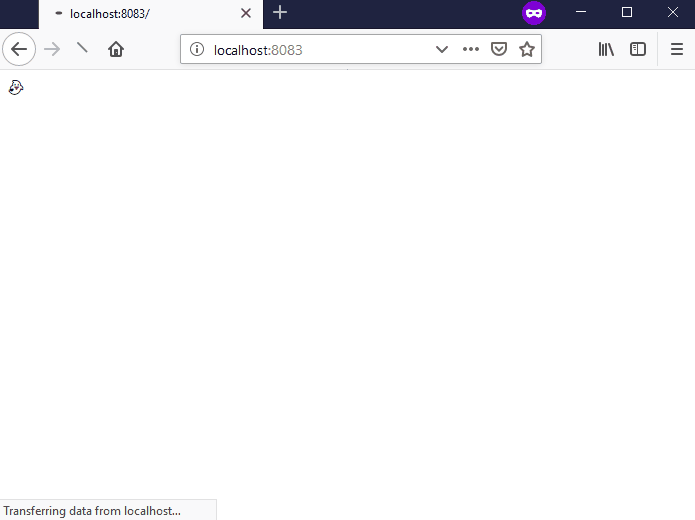

EMOJI STREAM
==========

Stream emojis over http. Hosted at [ghost.schroederspace.com](https://ghost.schroederspace.com/)

- No javascript



## Installation

With go installed:
```shell
go get -u github.com/jpschroeder/emoji-stream
```

## Usage

```shell
emoji-stream -h
  -emoji string
        the emoji shortcode to stream
        http://www.unicode.org/emoji/charts/emoji-list.html
         (default ":ghost:")
  -httpaddr string
        the address/port to listen on for http
        use :<port> to listen on all addresses
         (default "localhost:8083")
```

## Building

In order to build the project, just use:
```shell
go build
```

## Deploying

You can build the project under linux (or Windows Subsystem for Linux) and just copy the executable to your server.

You can then run the program directly or use systemd to install it as a service and keep it running.

Customize the `emoji-stream.service` file in the repo for your server and copy it to `/lib/systemd/system/emoji-stream.service` (ubuntu)

Start the app with: `systemctl start emoji-stream`  
Enable it on boot with: `systemctl enable emoji-stream`  
Check it's status with: `systemctl status emoji-stream`  
See standard output/error with: `journalctl -f -u emoji-stream`

### NGINX

You can host the application using go directly, or you can listen on a local port and use nginx to proxy connections to the app.

Make sure that nginx is installed with: `apt-get install nginx`

Customize `emoji-stream.nginx.conf` and copy it to `/etc/nginx/sites-available/emoji-stream.nginx.conf`

Remove the default website configuration: `rm /etc/nginx/sites-enabled/default`

Enable the go proxy: `ln -s /etc/nginx/sites-available/emoji-stream.nginx.conf /etc/nginx/sites-enabled/emoji-stream.nginx.conf`

Restart nginx to pick up the changes: `systemctl restart nginx`

### NGINX HTTPS

When running behind a proxy, you should enable https in nginx and forward to the localhost http address.

Install the letsencrypt client with: 

```shell
add-apt-repository ppa:certbot/certbot
apt-get install python-certbot-nginx
```

Generate and install a certificate with: `certbot --nginx -d emojistream.me`

The certificate should auto-renew when necessary.
